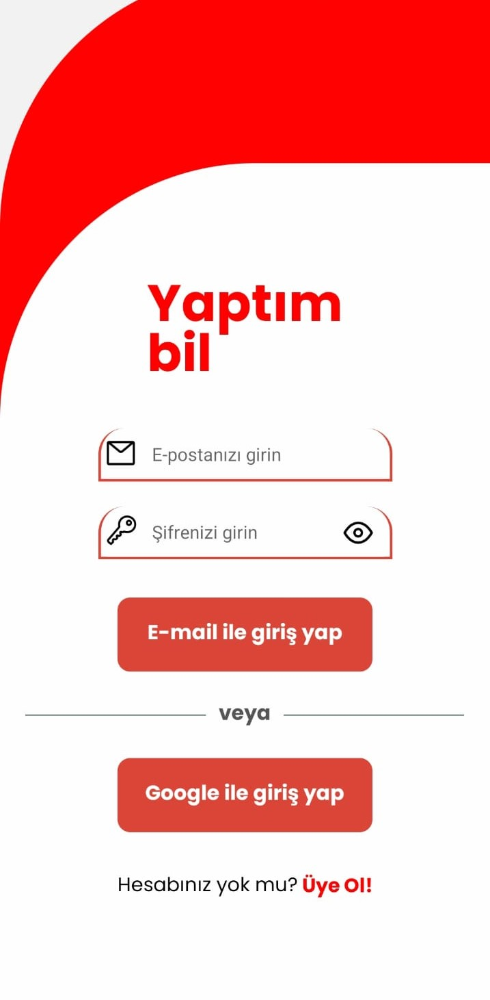
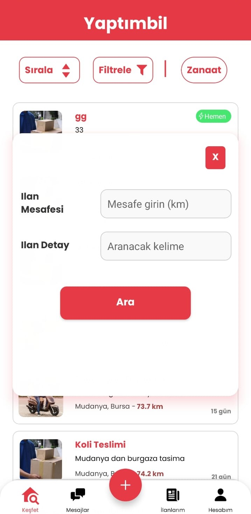

# Yaptimbil_App
Kendimin uzun süredir React Native,Expo,Firebase,Google Geolocation API kullanarak geliştirdiğim uygulamanın ekran görüntüleri.
https://play.google.com/store/apps/details?id=com.ahmet16.proje linkinden uygulamaya ulaşabilirsiniz.

